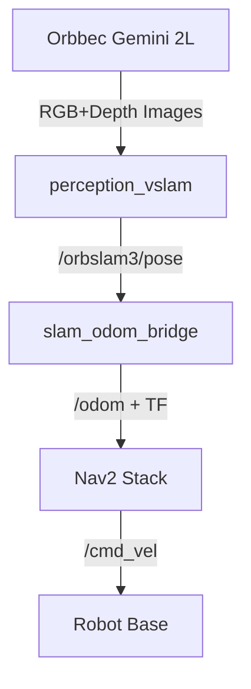

# Robot Workspace Documentation

This workspace contains the complete software stack for a mobile robot using **Orbbec Gemini 2L** for Visual SLAM and **Nav2** for autonomous navigation.


## 1. Environment Setup

### Prerequisites
- **Ubuntu 22.04 LTS**
- **ROS 2 Humble Hawksbill** ([Installation Guide](https://docs.ros.org/en/humble/Installation.html))

### Installation

1. **Clone the Repository**
   ```bash
   git clone https://github.com/KashmeeraTT/Ackerman_UGV.git robot_ws
   cd robot_ws
   ```

2. **Install Dependencies**
   We use `rosdep` to install system dependencies.
   ```bash
   rosdep install --from-paths src --ignore-src -r -y
   ```

3. **Install Build Tools (if not present)**
   ```bash
   sudo apt install python3-colcon-common-extensions
   ```

## 2. Build Instructions

Build the entire workspace using `colcon`.

```bash
colcon build --symlink-install
```

*Note: If you encounter symlink errors (common with some filesystems), try `colcon build` without the `--symlink-install` flag, or clean the build folder with `rm -rf build install log` and retry.*

## 3. System Architecture

The system uses ORB-SLAM3 for localization (generating Odometry) and Nav2 for path planning and control.



## 2. Package Overview

| Package Name | Purpose | Key Launch/Nodes |
| :--- | :--- | :--- |
| **robot_bringup** | Top-level entry point for the whole system. | `system.launch.py` |
| **perception_vslam** | Handles VSLAM startup and integration. | `vslam_bringup.launch.py` |
| **orbslam3_ros2** | Core Visual SLAM wrapper for ORB-SLAM3. | `orbslam3_ros2` node |
| **slam_odom_bridge** | Converts SLAM Poses to standard ROS 2 Odometry. | `slam_odom_bridge` node |
| **nav2_bringup_ack** | Navigation 2 stack configuration and launch. | `nav2_bringup.launch.py` |
| **OrbbecSDK_ROS2** | Drivers for Orbbec cameras. | `orbbec_camera` |
| **ackermann_bridge_demo**| Demonstrations/Bridge for vehicle control. | - |
| **ugv_teleop** | Teleoperation tools. | - |

## 3. Dependencies

- **ROS 2 Humble Hawksbill**
- **Navigation 2 (`nav2_bringup`, `navigation2`)**
- **OrbbecSDK**
- **Pangolin** (for ORB-SLAM3)
- **OpenCV**

## 5. How to Run

### Source the Workspace
Before running any command, always source the install setup:
```bash
source install/setup.bash
```

### Quick Start (All-in-One)
Launch the entire system including VSLAM, Navigation, and RViz:
```bash
ros2 launch robot_bringup system.launch.py
```
*Note: To disable auto-launch of RViz, use: `ros2 launch robot_bringup system.launch.py use_rviz:=false`*

### Manual Start (Component-wise)
For debugging or running specific parts:

**1. VSLAM & Camera only**
```bash
ros2 launch perception_vslam vslam_bringup.launch.py
```

**2. Navigation only**
```bash
ros2 launch nav2_bringup_ack nav2_bringup.launch.py
```

**3. Visualization**
```bash
ros2 launch robot_bringup rviz.launch.py
# OR manually:
ros2 run rviz2 rviz2 -d src/robot_bringup/rviz/robot.rviz
```

## 6. Troubleshooting

| Issue | Possible Cause | Solution |
|-------|---------------|----------|
| **No Map** | SLAM not tracking | Check ORB-SLAM debug window, ensure good lighting |
| **TF Error** | Missing transform | Run `ros2 run tf2_tools view_frames` to diagnose |
| **Robot Stalls** | Safety limits | Check `/robot/health` topic and `nav2_params.yaml` |
| **Nav2 Not Active** | Lifecycle failure | Check `ros2 lifecycle list /controller_server` |
| **SAFE STOP Triggered** | SLAM tracking lost | Relocate robot to textured area, restart SLAM |

## 7. Production Deployment

### Pre-Deployment Checklist
- [ ] Run integration tests: `ros2 run robot_bringup test_system_integration.py`
- [ ] Verify health monitor: `ros2 topic echo /robot/health`
- [ ] Check diagnostics: `ros2 topic echo /diagnostics`
- [ ] Test safe-stop: Cover camera briefly, verify robot stops

### Health Monitoring
The `health_monitor` node provides:
- **`/robot/health`**: Simple status (`OK`, `DEGRADED`, `STOPPED`)
- **`/diagnostics`**: Standard ROS2 diagnostics with SLAM status
- **Safe-stop**: Automatic velocity zeroing when SLAM is lost

### Parameter Tuning
Key parameters to tune for your environment:

| Parameter | File | Default | Notes |
|-----------|------|---------|-------|
| `minimum_turning_radius` | `nav2_params.yaml` | 1.5m | Match actual robot kinematics |
| `controller_frequency` | `nav2_params.yaml` | 10Hz | Increase for faster response |
| `odom_timeout` | `system.launch.py` | 2.0s | Safe-stop trigger delay |
| `transform_tolerance` | `nav2_params.yaml` | 0.5s | TF lookup tolerance |

### Running Integration Tests
```bash
# After launching the system, in a new terminal:
source install/setup.bash
ros2 run robot_bringup test_system_integration.py
```

Expected output: All TF frames and topics should show PASS.

