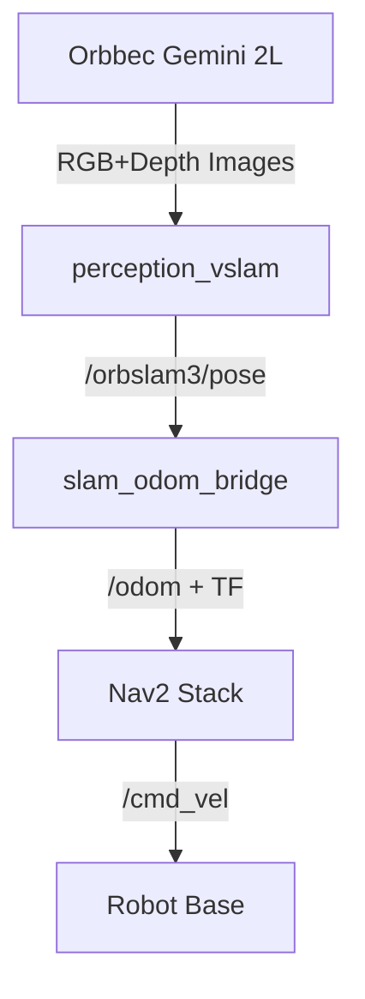

# Robot Workspace Documentation

This workspace contains the complete software stack for a mobile robot using **Orbbec Gemini 2L** for Visual SLAM and **Nav2** for autonomous navigation.

## 1. System Architecture

The system uses ORB-SLAM3 for localization (generating Odometry) and Nav2 for path planning and control.



## 2. Package Overview

| Package Name | Purpose | Key Launch/Nodes |
| :--- | :--- | :--- |
| **robot_bringup** | Top-level entry point for the whole system. | `system.launch.py` |
| **perception_vslam** | Handles VSLAM startup and integration. | `vslam_bringup.launch.py` |
| **orbslam3_ros2** | Core Visual SLAM wrapper for ORB-SLAM3. | `orbslam3_ros2` node |
| **slam_odom_bridge** | Converts SLAM Poses to standard ROS 2 Odometry. | `slam_odom_bridge` node |
| **nav2_bringup_ack** | Navigation 2 stack configuration and launch. | `nav2_bringup.launch.py` |
| **OrbbecSDK_ROS2** | Drivers for Orbbec cameras. | `orbbec_camera` |
| **ackermann_bridge_demo**| Demonstrations/Bridge for vehicle control. | - |
| **ugv_teleop** | Teleoperation tools. | - |

## 3. Dependencies

- **ROS 2 Humble Hawksbill**
- **Navigation 2 (`nav2_bringup`, `navigation2`)**
- **OrbbecSDK**
- **Pangolin** (for ORB-SLAM3)
- **OpenCV**

## 4. How to Run

### Quick Start (All-in-One)
If configured, you can launch the entire system with:
```bash
ros2 launch robot_bringup system.launch.py
```
*Note: This now launches RViz by default. To disable it, add `use_rviz:=false`.*

### Manual Start (Component-wise)
For better debugging, run components in separate terminals:

**1. VSLAM & Camera**
```bash
ros2 launch perception_vslam vslam_bringup.launch.py
```
*Verify: Check `/odom` topic and `map` -> `odom` -> `base_link` TF tree.*

**2. Navigation**
```bash
ros2 launch nav2_bringup_ack nav2_bringup.launch.py
```

**3. Visualization**
RViz is launched automatically with `system.launch.py`.
If you want to run it manually:
```bash
ros2 run rviz2 rviz2 -d $(ros2 pkg prefix robot_bringup)/share/robot_bringup/rviz/robot.rviz
```

## 5. Troubleshooting
- **No Map**: Ensure SLAM is tracking (check debug window if enabled).
- **TF Error**: Verify `static_transform_publisher` is running for camera link.
- **Robot Stalls**: Check `cmd_vel` output and safety limits in `nav2_params.yaml`.
