# Ackermann UGV System Documentation

Complete technical documentation for the Ackermann Unmanned Ground Vehicle (UGV) system.

---

## Table of Contents

1. [System Overview](#1-system-overview)
2. [Architecture Diagram](#2-architecture-diagram)
3. [Hardware Specifications](#3-hardware-specifications)
4. [Software Packages](#4-software-packages)
5. [Node Graph](#5-node-graph)
6. [Topic Reference](#6-topic-reference)
7. [TF Tree](#7-tf-tree)
8. [Data Flow Diagrams](#8-data-flow-diagrams)
9. [Firmware Architecture](#9-firmware-architecture)
10. [Control Logic](#10-control-logic)
11. [Safety Systems](#11-safety-systems)
12. [Command Reference](#12-command-reference)
13. [Configuration Files](#13-configuration-files)

---

## 1. System Overview

The Ackermann UGV is an autonomous ground vehicle using:
- **Visual SLAM** (ORB-SLAM3) for localization
- **Nav2** for path planning and navigation
- **micro-ROS** for ESP32 motor control
- **Ackermann kinematics** for steering

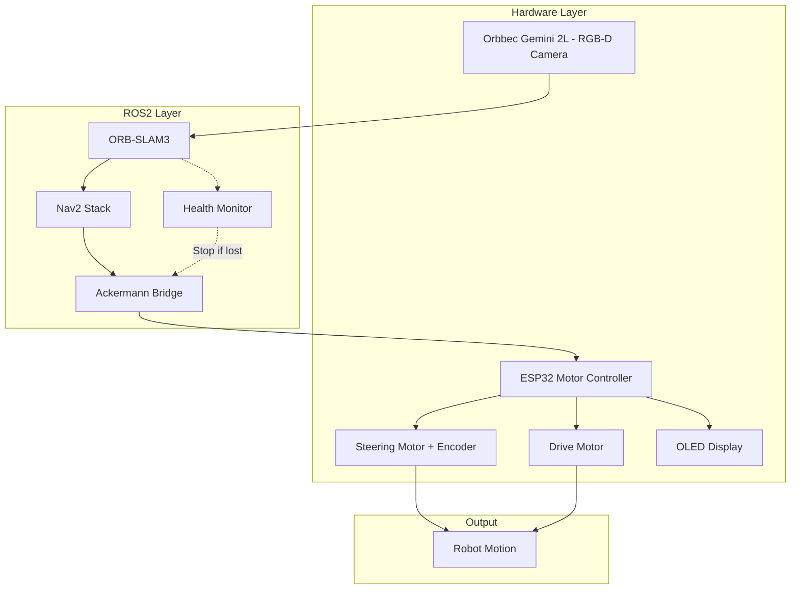

---

## 2. Architecture Diagram

### Complete System Architecture

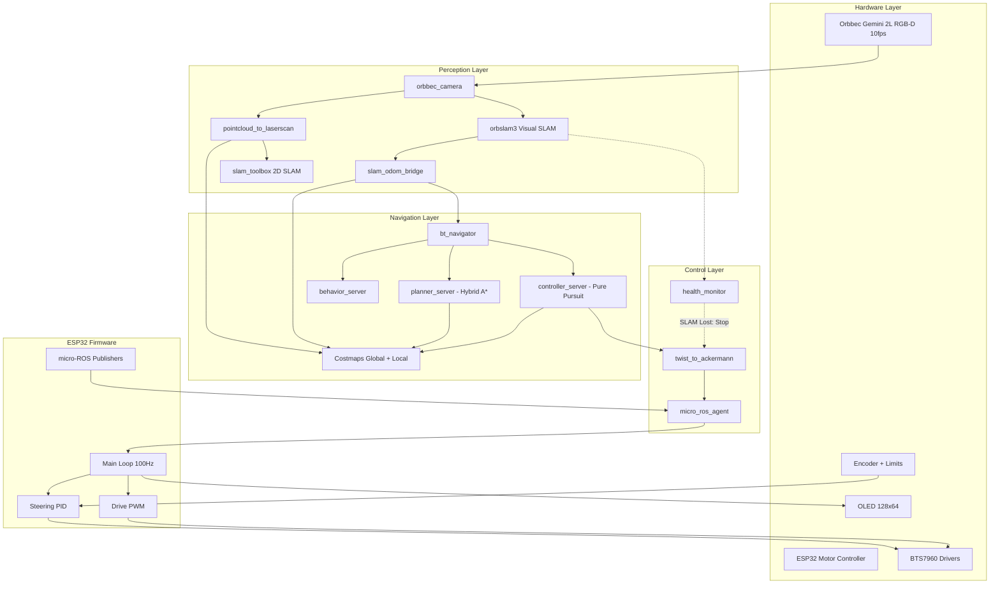

---

## 3. Hardware Specifications

### Robot Dimensions

| Parameter | Value | Unit |
|-----------|-------|------|
| Wheelbase | 0.60 | m |
| Track Width | 1.16 | m |
| Max Steering Angle | ±20 | degrees |
| Min Turn Radius | 1.65 | m |
| Max Speed | 0.5 | m/s |
| Max Acceleration | 0.6 | m/s² |

### Components

| Component | Model | Interface | Purpose |
|-----------|-------|-----------|---------|
| Compute | Jetson Xavier | - | Main computer |
| Camera | Orbbec Gemini 2L | USB 3.0 | RGB-D vision |
| MCU | ESP32 DevKit V1 | USB Serial | Motor control |
| Steering Driver | BTS7960 | PWM | Steering motor |
| Drive Driver | BTS7960 | PWM | Drive motor |
| Steering Encoder | Rotary Encoder | GPIO | Position feedback |
| Limit Switches | NO Switches x2 | GPIO | End stops |
| Display | SSD1306 OLED | I2C | Status display |

---

## 4. Software Packages

### Package Overview

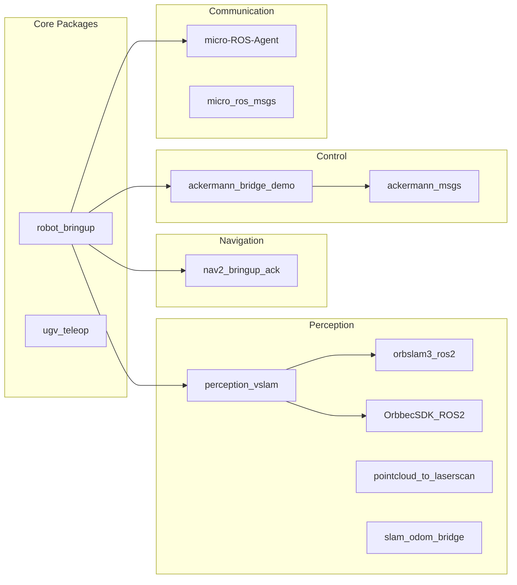

### Package Details

| Package | Type | Description |
|---------|------|-------------|
| `robot_bringup` | Launch/Config | Main launch files and system configuration |
| `ugv_teleop` | URDF/Config | Robot model and teleop configuration |
| `perception_vslam` | Launch | Visual SLAM launch and configuration |
| `orbslam3_ros2` | Node | ORB-SLAM3 ROS2 wrapper |
| `OrbbecSDK_ROS2` | Driver | Orbbec camera driver |
| `pointcloud_to_laserscan` | Node | Converts PointCloud2 to LaserScan |
| `slam_odom_bridge` | Node | Converts SLAM pose to odometry + TF |
| `nav2_bringup_ack` | Launch/Config | Nav2 with Ackermann parameters |
| `ackermann_bridge_demo` | Node | Twist to Ackermann conversion |
| `ackermann_msgs` | Messages | Ackermann message definitions |
| `micro-ROS-Agent` | Agent | micro-ROS USB serial bridge |
| `micro_ros_msgs` | Messages | micro-ROS message definitions |

---

## 5. Node Graph

### Active Nodes

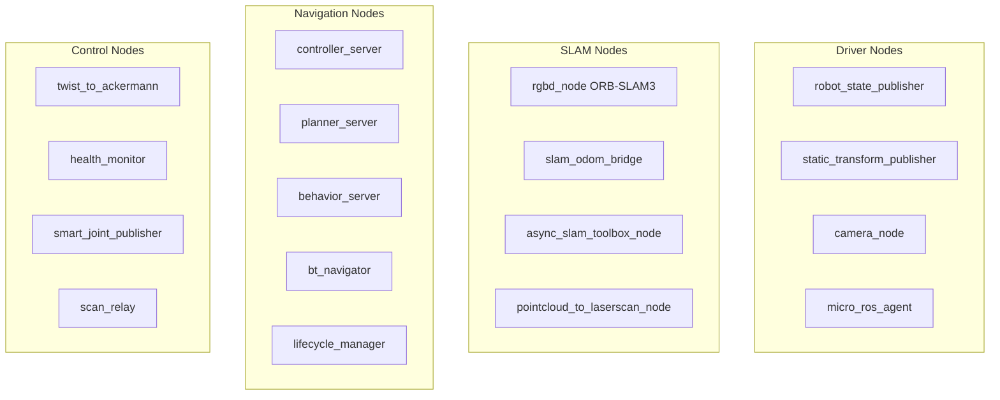

### Node Communication Matrix

| Node | Subscribes | Publishes |
|------|------------|-----------|
| `camera_node` | - | `/camera/color/image_raw`, `/camera/depth/image_raw` |
| `rgbd_node` | `/camera/*` | `/orbslam3/camera_pose` |
| `slam_odom_bridge` | `/orbslam3/camera_pose` | `/odom`, TF: odom→base_link |
| `pointcloud_to_laserscan` | `/camera/depth/points` | `/scan` |
| `controller_server` | `/scan`, `/odom`, `/plan` | `/cmd_vel` |
| `twist_to_ackermann` | `/cmd_vel`, `/ugv/steering_angle` | `/ackermann_cmd` |
| `micro_ros_agent` | - | - (bridge to ESP32) |
| `health_monitor` | `/orbslam3/camera_pose` | `/robot/health` |

---

## 6. Topic Reference

### Complete Topic List

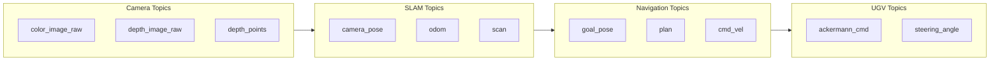

### Topic Details

| Topic | Type | Rate | Publisher | Subscriber | Description |
|-------|------|------|-----------|------------|-------------|
| `/camera/color/image_raw` | Image | 10 Hz | camera_node | rgbd_node | Color image |
| `/camera/depth/image_raw` | Image | 10 Hz | camera_node | rgbd_node | Depth image |
| `/camera/depth/points` | PointCloud2 | 10 Hz | camera_node | p2l_node | Point cloud |
| `/orbslam3/camera_pose` | PoseStamped | 30 Hz | rgbd_node | slam_odom_bridge | SLAM pose |
| `/odom` | Odometry | 20 Hz | slam_odom_bridge | Nav2 | Robot odometry |
| `/scan` | LaserScan | 10 Hz | p2l_node | Nav2 | 2D laser scan |
| `/cmd_vel` | Twist | 10 Hz | controller_server | twist_to_ackermann | Velocity command |
| `/ackermann_cmd` | AckermannDriveStamped | 20 Hz | twist_to_ackermann | micro_ros_agent | Ackermann command |
| `/ugv/status` | String | 10 Hz | ESP32 | - | Status string |
| `/ugv/heartbeat` | Bool | 10 Hz | ESP32 | - | Heartbeat |
| `/ugv/steering_angle` | Float32 | 20 Hz | ESP32 | twist_to_ackermann | Actual steering |
| `/robot/health` | String | 1 Hz | health_monitor | - | System health |
| `/goal_pose` | PoseStamped | - | User/RViz | bt_navigator | Navigation goal |

---

## 7. TF Tree

### Transform Hierarchy

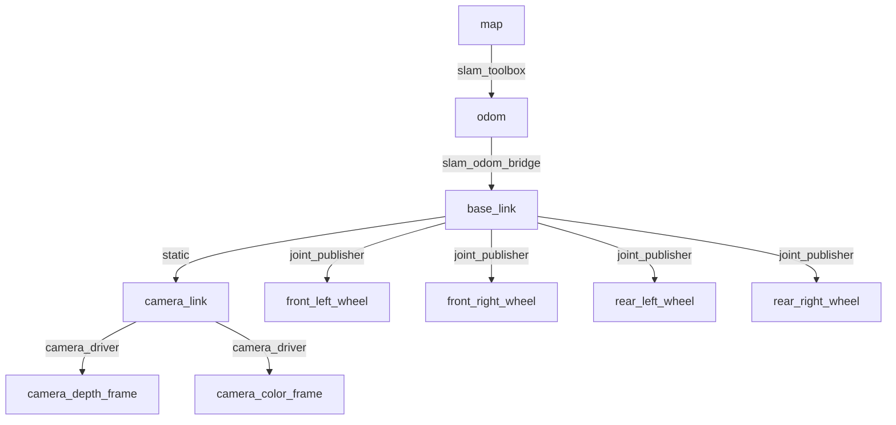

### Transform Publishers

| Transform | Publisher | Rate | Type |
|-----------|-----------|------|------|
| map → odom | slam_toolbox | 20 Hz | Dynamic |
| odom → base_link | slam_odom_bridge | 20 Hz | Dynamic |
| base_link → camera_link | static_transform_publisher | - | Static |
| camera_link → depth_frame | camera_node | - | Static |
| base_link → wheels | smart_joint_publisher | 10 Hz | Dynamic |

---

## 8. Data Flow Diagrams

### Perception Pipeline

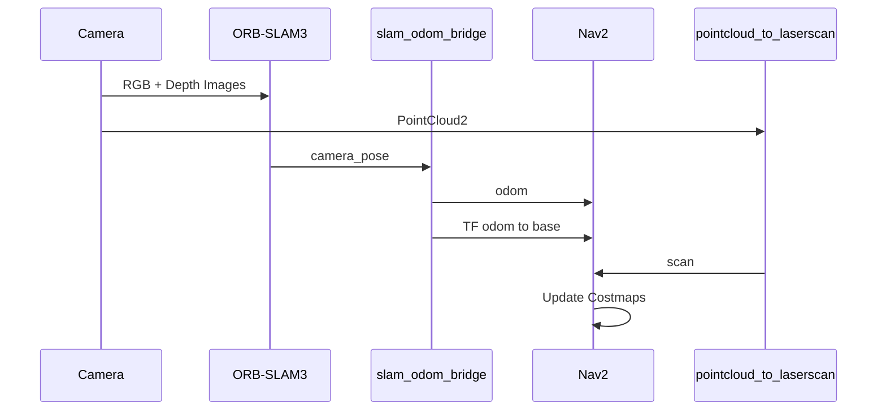

### Navigation Pipeline

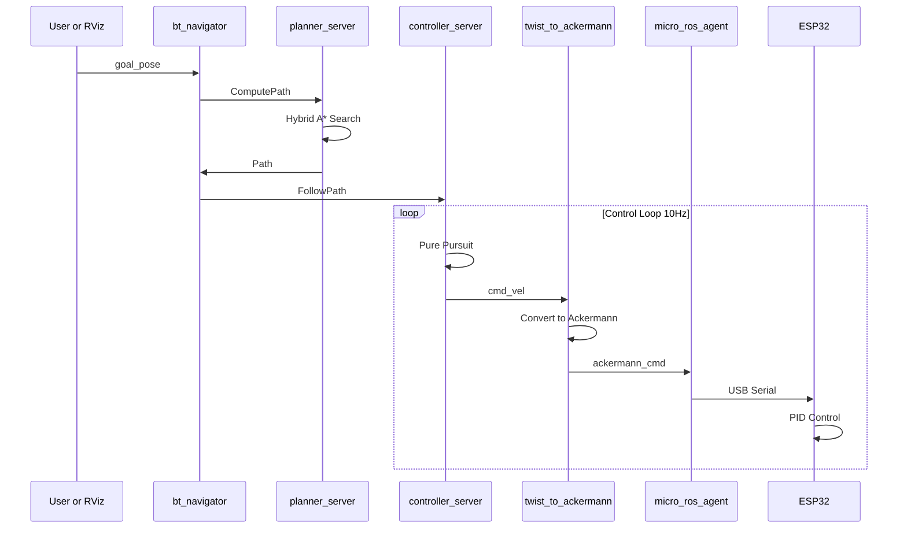

### Safety Pipeline

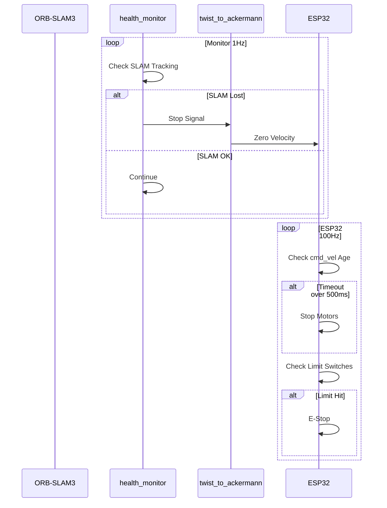

---

## 9. Firmware Architecture

### ESP32 Main Loop

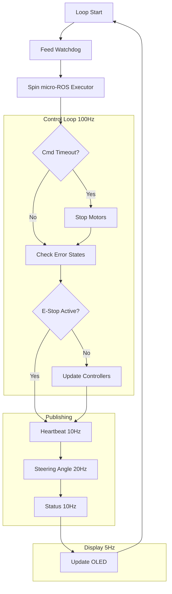

### Steering Controller Logic

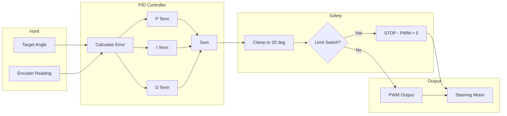

### OLED Display Layout

```
+----------------------------+ Y=0
| READY/RUNNING/TIMEOUT      | Row 1: Mode (large)
+----------------------------+ Y=20
| ROS:OK  Cmd:234ms          | Row 2: Connection
+----------------------------+ Y=32
| Steer:5.0/5.0              | Row 3: Steering
+----------------------------+ Y=42
| Speed:0.25m/s    E:1234    | Row 4: Speed+Encoder
+----------------------------+ Y=54
| L:OK  R:OK      [IDLE]     | Row 5: Limits+Status
+----------------------------+ Y=64
```

---

## 10. Control Logic

### Ackermann Kinematics

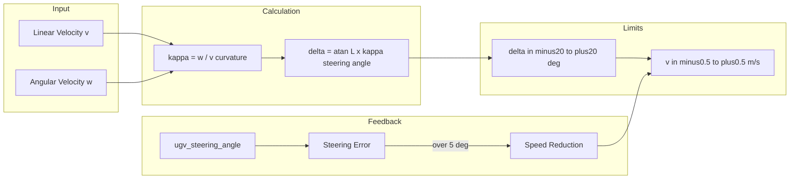

**Formulas:**

| Parameter | Formula | Description |
|-----------|---------|-------------|
| Curvature | κ = ω / v | Instantaneous curvature |
| Steering Angle | δ = atan(L × κ) | L = wheelbase (0.6m) |
| Turn Radius | R = L / tan(δ) | Minimum ~1.65m |
| Speed Factor | f = max(0.3, 1 - error/15) | Steering feedback |

### PID Tuning (Steering)

```
Kp = 2.5    (Proportional gain)
Ki = 0.1    (Integral gain)
Kd = 0.5    (Derivative gain)
```

---

## 11. Safety Systems

### Safety Hierarchy

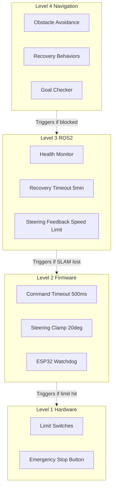

### Safety Response Table

| Condition | Detection | Response | Recovery |
|-----------|-----------|----------|----------|
| SLAM Lost | health_monitor | Stop robot | Wait for tracking |
| Limit Switch | ESP32 GPIO | E-Stop, center steering | Manual reset |
| Command Timeout | ESP32 500ms | Stop motors | Automatic on cmd |
| Obstacle | Nav2 Costmap | Replan path | Automatic |
| Goal Unreachable | Nav2 | Recovery behaviors | Retry or abort |
| Steering Lag | twist_to_ackermann | Reduce speed | Automatic |

---

## 12. Command Reference

### Launch Commands

```bash
# Full system launch
ros2 launch robot_bringup system.launch.py use_micro_ros:=true

# With RViz visualization
ros2 launch robot_bringup system.launch.py use_rviz:=true

# SLAM only (no navigation)
ros2 launch perception_vslam vslam_bringup.launch.py

# Navigation only
ros2 launch nav2_bringup_ack nav2_bringup.launch.py
```

### Topic Commands

```bash
# Send velocity command
ros2 topic pub /cmd_vel geometry_msgs/msg/Twist "{linear: {x: 0.1}, angular: {z: 0.0}}"

# Send navigation goal
ros2 topic pub /goal_pose geometry_msgs/msg/PoseStamped "{header: {frame_id: 'map'}, pose: {position: {x: 1.0, y: 0.0}, orientation: {w: 1.0}}}"

# Monitor ESP32 status
ros2 topic echo /ugv/status

# Check steering angle
ros2 topic echo /ugv/steering_angle

# Monitor health
ros2 topic echo /robot/health
```

### Service Commands

```bash
# Clear costmaps
ros2 service call /global_costmap/clear_entirely_global_costmap nav2_msgs/srv/ClearEntireCostmap

# Cancel navigation
ros2 action send_goal /navigate_to_pose nav2_msgs/action/NavigateToPose "{}" --cancel
```

### Firmware Commands

```bash
# Build firmware
cd ~/robot_ws/firmware && pio run

# Upload firmware
cd ~/robot_ws/firmware && pio run --target upload

# Monitor serial
cd ~/robot_ws/firmware && pio device monitor
```

---

## 13. Configuration Files

### Key Configuration Files

| File | Purpose | Key Parameters |
|------|---------|----------------|
| `nav2_params.yaml` | Navigation tuning | speeds, tolerances, costmap |
| `tuning.yaml` | System parameters | timeouts, rates |
| `ackermann.rviz` | RViz config | visualization |
| `platformio.ini` | Firmware config | board, libs |
| `pin_config.h` | ESP32 pins | GPIO assignments |

### Nav2 Parameters Summary

```yaml
# Planner (Hybrid A*)
planner_server:
  minimum_turning_radius: 1.65  # meters
  
# Controller (Pure Pursuit)
controller_server:
  desired_linear_vel: 0.4
  min_lookahead_dist: 0.6
  max_lookahead_dist: 1.5
  
# Costmaps
local_inflation_radius: 0.80
global_inflation_radius: 0.50
robot_footprint: [[-0.5, -0.3], [0.5, -0.3], [0.5, 0.3], [-0.5, 0.3]]
```

### ESP32 Pin Assignment

| Function | GPIO Pin |
|----------|----------|
| Steering LPWM | GPIO 25 |
| Steering RPWM | GPIO 26 |
| Driving LPWM | GPIO 27 |
| Driving RPWM | GPIO 14 |
| Encoder A | GPIO 34 |
| Encoder B | GPIO 35 |
| Left Limit | GPIO 32 |
| Right Limit | GPIO 33 |
| I2C SDA | GPIO 21 |
| I2C SCL | GPIO 22 |

---

## Appendix A: Message Types

### geometry_msgs/Twist

| Field | Type | Description |
|-------|------|-------------|
| linear.x | float64 | Forward velocity (m/s) |
| linear.y | float64 | Lateral velocity (m/s) |
| linear.z | float64 | Vertical velocity (m/s) |
| angular.x | float64 | Roll rate (rad/s) |
| angular.y | float64 | Pitch rate (rad/s) |
| angular.z | float64 | Yaw rate (rad/s) |

### ackermann_msgs/AckermannDriveStamped

| Field | Type | Description |
|-------|------|-------------|
| header | Header | Timestamp and frame |
| drive.steering_angle | float32 | Steering angle (rad) |
| drive.steering_angle_velocity | float32 | Steering rate |
| drive.speed | float32 | Speed (m/s) |
| drive.acceleration | float32 | Acceleration |
| drive.jerk | float32 | Jerk |

---

## Appendix B: Coordinate Frames

| Frame | Origin | X-axis | Z-axis |
|-------|--------|--------|--------|
| map | World origin | East | Up |
| odom | Robot start | Forward | Up |
| base_link | Robot center | Forward | Up |
| camera_link | Camera mount | Forward | Up |
| camera_depth_frame | Depth sensor | Right | Forward |

---

*Document Version: 1.0*  
*Last Updated: December 2024*
